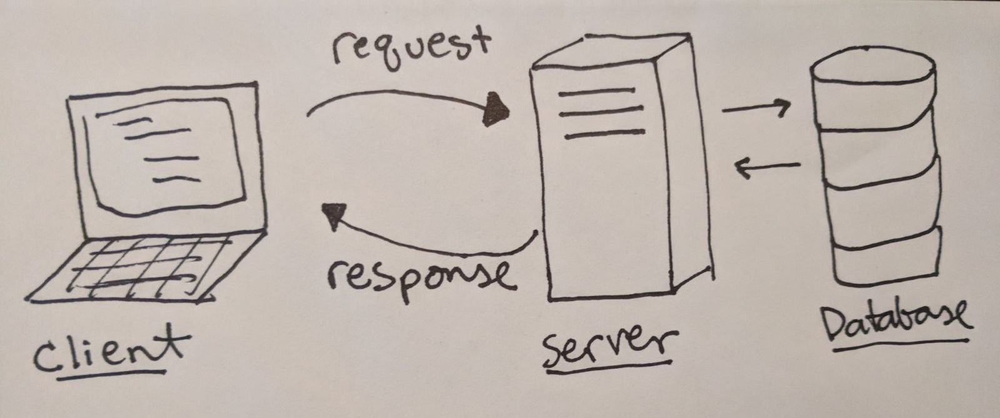

## Useful charts and diagrams

### The HTTP request-response cycle

### HTTP Verbs, actions, and routes

| HTTP Verb  |   Example Route | route meaning |Action   | 
| ------------- |:-------------:| -----:| -----:|
| `GET`     | /api/creatures | `index` of all creatures  |Read |
| `GET`       | /api/creatures/:id     |   `show` one creature | Read |
| `POST` | /api/creatures     |    `create` one creature |Create |
| `PUT` | /api/creatures/:id       |    `update` one creature |Update |
| `DELETE` | /api/creatures/:id       |    `delete` one creature |Delete|